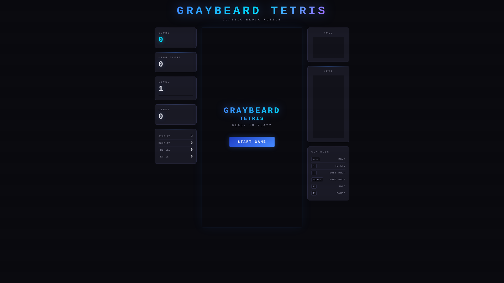
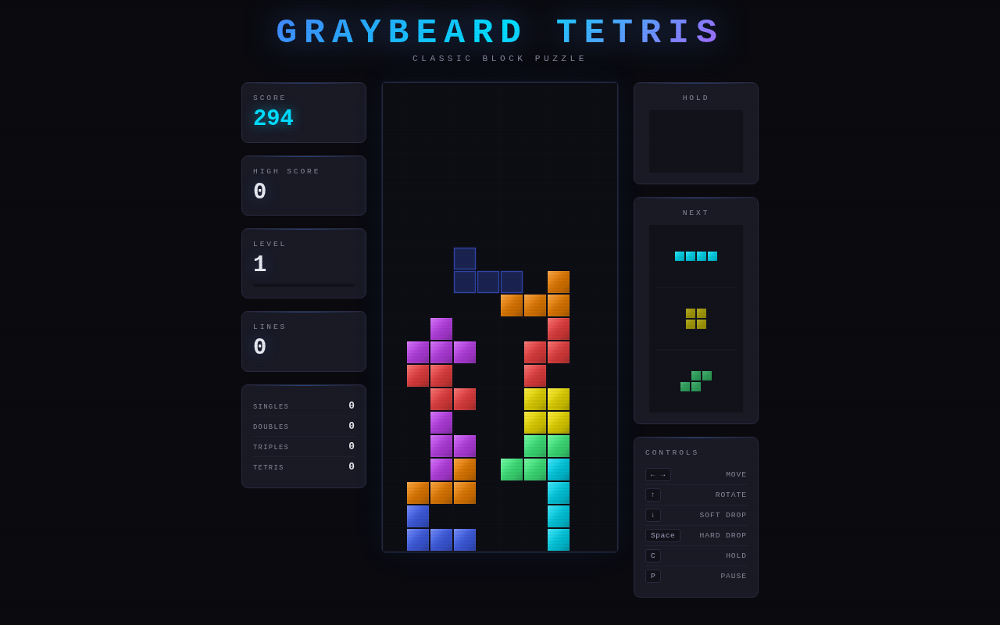
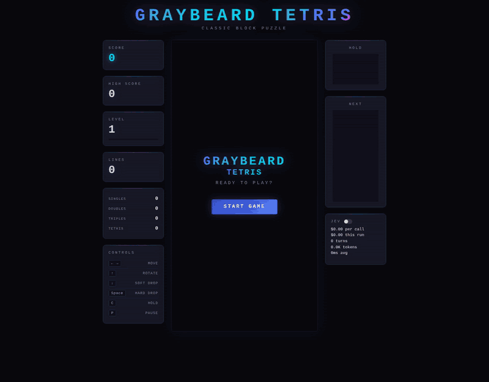

# Tetris Demo

A fully functional Tetris game served by [Bun](https://bun.sh). Dark retro theme with scanline effects, glow rendering, and mobile touch controls.

**[Play it live](https://0xsalt.github.io/tetris/)**

<p align="center">
  
  
</p>

## Jev plays

<p align="center">
  
</p>

The game in `graybeard-demo/` has a "Jev plays" switch. When it is on, [TypeSafe](https://typesafe.ai)'s Jev model picks where every piece lands. The API key lives in a local env file on the server and never reaches the browser. For each piece, the server asks Jev one multiple-choice question. The code does the counting: it works out the board facts (column heights, tallest column, covered holes) and lists every legal landing spot with exact numbers for the lines it clears, the holes it covers, and the height and bumpiness it leaves behind. Jev only picks one of those options, and the server rejects any answer that isn't on the list. A daily dollar cap and a pace of one piece per second keep the bill small. Jev is off on every page load; only the switch turns it on.

The [live page](https://0xsalt.github.io/tetris/) is the plain game. Jev runs only on a server you start with your own key (see below).

## Features

- **SRS wall kicks** — Standard Rotation System with full kick tables for all pieces including I-piece
- **7-bag randomizer** — Fair piece distribution per official Tetris guidelines
- **Ghost piece** — Preview where the current piece will land
- **Hold piece** — Swap the current piece into hold with `C`
- **Next-3 preview** — See the upcoming three pieces
- **Lock delay** — 500ms lock timer with move reset (max 15 resets)
- **Scoring** — Level progression, line clear stats (singles/doubles/triples/tetris), high score via localStorage
- **Mobile controls** — Touch-friendly buttons on small screens
- **Responsive** — Canvas auto-sizes to fit the viewport

## Quick Start

```bash
git clone https://github.com/0xsalt/tetris.git
cd tetris
bun install
bun start
```

Opens on `http://localhost:3000` (or set `PORT` env var). See [INSTALL.md](INSTALL.md) for systemd service setup and other options.

## Controls

| Key | Action |
|-----|--------|
| Arrow Left/Right | Move |
| Arrow Up | Rotate clockwise |
| Z | Rotate counter-clockwise |
| Arrow Down | Soft drop |
| Space | Hard drop |
| C | Hold |
| P / Esc | Pause |

## Run Jev with your own key

1. Get a TypeSafe API key from the [TypeSafe console](https://console.typesafe.ai/) ([docs](https://docs.typesafe.ai/)).
2. Put the key in an env file only you can read:

   ```bash
   mkdir -p ~/.config/tetris-demo
   echo 'TYPESAFE_API_KEY=your-key-here' > ~/.config/tetris-demo/jev.env
   chmod 600 ~/.config/tetris-demo/jev.env
   ```

3. Start the Jev server from your clone of this repo:

   ```bash
   cd graybeard-demo
   bun install
   bun start
   ```

4. Open `http://localhost:3000` and turn on the Jev switch under Next. The startup line says `jev enabled`. Without a key file the game still runs, just without the switch.

**What it costs.** TypeSafe charges $42 per billion input tokens, and output tokens are free. One move is about 2,000 input tokens, which comes to roughly $0.0001 per move. At one move a second that is about $0.30 an hour. The server stops calling Jev once it hits a daily cap, $1.50 by default.

**Settings** (environment variables):

| Variable | Default | What it does |
|----------|---------|--------------|
| `JEV_ENV_FILE` | `~/.config/tetris-demo/jev.env` | Where the key is read from |
| `JEV_DAILY_USD_CAP` | `1.50` | Daily spending limit in US dollars |
| `JEV_LOG_FILE` | `~/.local/state/tetris-demo/jev-calls.jsonl` | Log of every call: piece, choice, confidence, tokens, latency. Never the key. |
| `JEV_RATE_PER_MIN` | `120` | Most Jev calls per minute, across all viewers |
| `JEV_ALLOWED_HOSTS` | (empty) | Extra host names the server answers to. `localhost`, `127.0.0.1` and Tailscale `*.ts.net` names are always allowed. |
| `PORT` | `3000` | Port, on 127.0.0.1 only |

The server listens on loopback only. To reach it from other machines, put a reverse proxy in front of it, such as `tailscale serve`, and add the proxy's host name to `JEV_ALLOWED_HOSTS` if it is not a `*.ts.net` name.

### How a move works

1. **Browser → server.** For each new piece, the page sends `POST /api/decide` with the board as 22 strings of ten `0`/`1` characters, the piece letter, and the next three pieces.
2. **Server.** It lists every legal landing spot, each with a key like `r1x4` (rotation 1, column 4), and computes the numbers for each one.
3. **Server → TypeSafe.** It sends `POST https://api.typesafe.ai/v1/systemone`. The `state` field holds the board facts and the pieces, and `model` is `jev-latest`. The `questions` field holds one `choice` question with plain instructions and one entry per landing spot.
4. **TypeSafe → server.** Jev answers with its `choice`, a probability for every option, a `confidence`, and the token `usage`.
5. **Server → browser.** The server rejects any answer that is not on the list, logs the call, and charges the daily budget. It then returns the rotation and column, and the page hard-drops the piece there.

## Stack

- **Runtime:** Bun
- **Language:** TypeScript
- **Frontend:** Single HTML file with inline CSS/JS, Canvas API rendering
- **Server:** `Bun.serve()` static file server

## License

MIT
